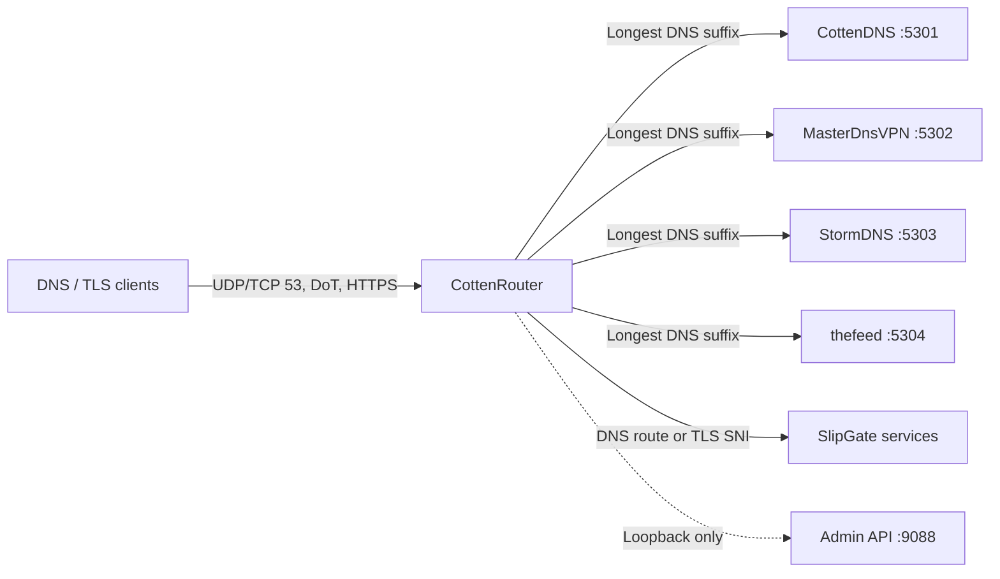
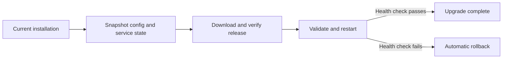

<div align="center">

# CottenRouter

### One public gateway for multiple DNS tunnels

**Fast, safe, and payload-transparent routing for DNS and TLS transports.**

[](https://github.com/TaJirax/CottenRouter/releases/latest)
[](https://github.com/TaJirax/CottenRouter/actions/workflows/ci.yml)
[](go.mod)
[](LICENSE)
[](https://github.com/TaJirax/CottenRouter/pkgs/container/cottenrouter)

[فارسی](README.fa.md) · [Install](#-installation) · [Usage](#-control-deck) · [Commands](#-command-reference) · [Docker](#-docker) · [Upgrade](#-upgrade) · [Uninstall](#-uninstall) · [Credits](#-projects-and-credits)

</div>

---

## ✨ Overview

**CottenRouter** is a lightweight front router that lets multiple DNS-tunnel backends share one server, one IP address, and public port `53`. It reads the first DNS question, selects the longest matching configured suffix, and forwards the packet to the correct private backend.

It can also share public DoT and HTTPS ports by reading TLS SNI and passing each encrypted stream through unchanged. CottenRouter does not terminate TLS, add DNS labels, or add protocol bytes, so it does not reduce tunnel MTU.

Key features:

- Concurrent routing for several DNS-tunnel projects on one public endpoint
- UDP DNS, DNS-over-TCP, DoT, DoH, NaiveProxy, and StunTLS passthrough
- Guided terminal UI for installation, configuration, monitoring, and removal
- Transactional host installation with snapshots, health checks, and rollback
- Fixed queues, rate limits, timeouts, connection caps, and resource controls
- Loopback-only administration API and a dashboard refreshed every two seconds
- Rootless, read-only, shell-free Docker image
- Checksum-verified `linux/amd64` and `linux/arm64` release binaries

### How traffic flows



### Choose a deployment

| | **Host installation** | **Docker** |
|---|---|---|
| Routing core | ✅ | ✅ |
| Guided backend installers | ✅ | — |
| Interactive control deck | ✅ | — |
| systemd and firewall integration | ✅ | — |
| Rootless runtime | — | ✅ |
| Best for | A fresh server managed end to end | Existing container infrastructure |

---

## ✅ Requirements

For a host installation you need:

- Linux with `systemd 245+`
- `root` or `sudo` access
- A public IP and at least one unique domain or subdomain for each backend
- Ubuntu 20.04+, Debian 11+, or RHEL/Rocky/AlmaLinux 9+ is recommended
- `amd64` or `arm64` for a prebuilt binary; other architectures build from source

WSL is supported for development and testing only. Use a native Linux server for production.

---

## 🚀 Installation

### Latest stable release

```bash
curl -fsSL https://raw.githubusercontent.com/TaJirax/CottenRouter/main/scripts/install.sh | sudo bash
sudo cottenrouter tui
```

The installer downloads the latest [official release](https://github.com/TaJirax/CottenRouter/releases/latest), verifies its checksum, checks required tools, systemd, disk space, and listeners, and waits for a successful health check. A failed installation restores the previous state. Running the command again performs an in-place upgrade.

Install a specific release:

```bash
curl -fsSL https://raw.githubusercontent.com/TaJirax/CottenRouter/main/scripts/install.sh \
  | sudo bash -s -- --version=v1.2.9
```

Install the current development branch:

```bash
curl -fsSL https://raw.githubusercontent.com/TaJirax/CottenRouter/main/scripts/install.sh \
  | sudo bash -s -- --channel=edge
```

Build from source during installation:

```bash
curl -fsSL https://raw.githubusercontent.com/TaJirax/CottenRouter/main/scripts/install.sh \
  | sudo bash -s -- --build-from-source
```

| Installer option | Purpose |
|---|---|
| `--version=vX.Y.Z` | Install an exact tagged release |
| `--channel=stable` | Install the latest release; this is the default |
| `--channel=edge` | Build the latest default-branch commit for testing |
| `--build-from-source` | Compile locally instead of using a release binary |
| `--no-swap` | Skip the installer-owned emergency swap safeguard |

---

## 🧭 Control deck

```bash
sudo cottenrouter tui
```

| Key | Action |
|---|---|
| `Space` | Select or deselect a project |
| `i` | Run guided installation for selected projects |
| `Enter` / `e` | Edit domains, private ports, TCP, DoT, and DoH |
| `a` | Open the complete native project configuration |
| `s` | Restart a project |
| `u` | Detach a project while preserving its files |
| `x` | Permanently remove a project after confirmation |
| `v` | Show credential paths and public values |
| `V` | Reveal secrets after explicit confirmation |

Give every backend a unique delegated domain, for example `cotten.example.com`, `master.example.com`, `storm.example.com`, and `feed.example.com`. Exact duplicate suffixes are rejected. Nested suffixes are supported and the longest match wins.

---

## 📊 Status and configuration

```bash
sudo systemctl status cottenrouter
sudo journalctl -u cottenrouter -f
sudo cottenrouter healthz -config /etc/cottenrouter/config.json
curl -fsS http://127.0.0.1:9088/v1/status
```

Validate or run a configuration manually:

```bash
cottenrouter check -config cottenrouter.json
cottenrouter serve -config cottenrouter.json
```

Start with [`cottenrouter.example.json`](cottenrouter.example.json), or use [`cottenrouter.docker.json`](cottenrouter.docker.json) for containers. Unknown configuration fields are rejected.

Import an existing SlipGate configuration:

```bash
cottenrouter slipgate-import \
  --input /etc/slipgate/config.json \
  --output cottenrouter.json
```

Inspect current upstream projects and installers:

```bash
cottenrouter catalog
cottenrouter catalog --offline
```

The online catalog resolves and verifies each project's current default branch. The offline output is bundled fallback metadata and is not recommended for installation.

---

## 📚 Command reference

```text
cottenrouter tui               Install, manage, and monitor projects
cottenrouter serve             Run the router with a configuration
cottenrouter check             Validate a configuration without serving
cottenrouter healthz           Probe router health
cottenrouter install           Install a backend from the CLI
cottenrouter configure         Edit stable backend settings
cottenrouter advanced          Edit advanced native backend settings
cottenrouter service           Start, stop, or restart a project
cottenrouter remove            Detach or purge a project
cottenrouter uninstall         Alias for the project removal operation
cottenrouter keys              Display project credentials
cottenrouter catalog           List current projects and installers
cottenrouter slipgate-import   Convert an existing SlipGate configuration
cottenrouter version           Print the installed version
```

Use `cottenrouter <command> --help` for command-specific options.

Manage a service directly:

```bash
sudo cottenrouter service --project=cottendns --action=restart
sudo cottenrouter service --project=stormdns --action=stop
sudo cottenrouter service --project=stormdns --action=start
```

Detach one backend while preserving its files:

```bash
sudo cottenrouter remove --project=cottendns
```

Permanently remove that backend's managed data:

```bash
sudo cottenrouter remove --project=cottendns --purge --confirm=cottendns
```

---

## 🐳 Docker

The container runs the routing core only. You remain responsible for the lifecycle of backend containers.

```bash
curl -fsSLO https://raw.githubusercontent.com/TaJirax/CottenRouter/main/docker-compose.yml
curl -fsSLO https://raw.githubusercontent.com/TaJirax/CottenRouter/main/cottenrouter.docker.json

# Replace the example domain and backend in cottenrouter.docker.json
docker compose up -d
```

Check health:

```bash
docker compose exec cottenrouter \
  /usr/local/bin/cottenrouter healthz \
  -config /etc/cottenrouter/config.json
```

Update or remove the container:

```bash
docker compose pull
docker compose up -d
docker compose down
```

The official [`ghcr.io/tajirax/cottenrouter`](https://github.com/TaJirax/CottenRouter/pkgs/container/cottenrouter) image supports `linux/amd64` and `linux/arm64`. It listens on unprivileged port `5353` inside the container while Docker publishes host port `53`. It runs as UID `65532`, drops all capabilities, uses a read-only root filesystem, and includes no shell. See the [Docker guide](docs/docker.md).

---

## 🔄 Upgrade

The installer upgrades CottenRouter **in place**. It snapshots the active configuration, replaces the binary, validates the configuration, restarts the service, and waits for the health probe. If any step fails, it restores the previous installation automatically.



### Upgrade to the latest stable release

```bash
curl -fsSL https://raw.githubusercontent.com/TaJirax/CottenRouter/main/scripts/install.sh | sudo bash
```

### Upgrade or downgrade to an exact release

Pinning a version is useful for reproducible deployments or returning to a known release:

```bash
curl -fsSL https://raw.githubusercontent.com/TaJirax/CottenRouter/main/scripts/install.sh \
  | sudo bash -s -- --version=v1.2.9
```

Available versions are listed on the [Releases page](https://github.com/TaJirax/CottenRouter/releases).

### Upgrade to the development channel

Use this only when you intentionally want the latest default-branch commit:

```bash
curl -fsSL https://raw.githubusercontent.com/TaJirax/CottenRouter/main/scripts/install.sh \
  | sudo bash -s -- --channel=edge
```

### Upgrade Docker

```bash
docker compose pull
docker compose up -d
```

The configuration is a read-only bind mount, so replacing the container does not replace your local config file.

### Verify the upgrade

```bash
cottenrouter version
sudo systemctl --no-pager --full status cottenrouter
sudo cottenrouter healthz -config /etc/cottenrouter/config.json
```

> **Production tip:** use the stable channel or an exact version. Take a server snapshot before upgrading upstream backend projects, because their native installers run as root and are maintained independently.

---

## 🗑️ Uninstall

Safely remove CottenRouter while preserving configuration, upstream projects, panels, pre-existing firewall rules, and swap:

```bash
sudo cottenrouter-uninstall
```

Also delete the router configuration:

```bash
sudo cottenrouter-uninstall --purge --confirm CottenRouter
```

Delete CottenRouter, every managed backend, and their managed data:

```bash
sudo cottenrouter-uninstall \
  --purge \
  --purge-backends \
  --confirm CottenRouter
```

Remove only swap created and marked as owned by the installer:

```bash
sudo cottenrouter-uninstall --remove-swap --confirm CottenRouter
```

Purge operations cannot be undone. CottenRouter removes only firewall rules, accounts, and swap carrying its ownership markers; it does not remove pre-existing state.

---

## 🛡️ Routing and security model

1. Parse the first DNS question and drop malformed packets.
2. Select the longest configured domain suffix.
3. Allocate a transaction ID on a connected backend socket.
4. Forward the packet unchanged apart from that temporary ID.
5. Accept a reply only when its question name, type, and class match exactly.
6. Restore the client's original ID and return the reply.

IDs are never reused in one socket generation. After all 65,536 IDs have been consumed, CottenRouter rotates to a new source port so a late response cannot enter the new generation.

Remote backends are rejected by default, both UDP and TCP messages are capped at `16 KiB`, and the admin API must remain on loopback. Transaction-ID and question matching is not cryptographic authentication; configured backends are trusted. Host backend installers run as root, so snapshot the server before running an upstream release you have not reviewed.

Read more in [Security](docs/security.md), [Installer and control deck](docs/installer.md), and [Backend integration](docs/backend-integration.md).

---

## 🛠️ Build, test, and contribute

```bash
git clone https://github.com/TaJirax/CottenRouter.git
cd CottenRouter
go build -o cottenrouter ./cmd/cottenrouter

go test ./...
go test -race ./...
go vet ./...
gofmt -w cmd internal
```

CI also checks five-backend isolation under load, full `16 KiB` packets, throughput, concurrent DoT/DoH and NaiveProxy/StunTLS routing, formatting, and the rootless Docker image.

Use [Issues](https://github.com/TaJirax/CottenRouter/issues) for bugs and feature requests, and [Pull Requests](https://github.com/TaJirax/CottenRouter/pulls) for code contributions.

### Documentation

| Guide | Contents |
|---|---|
| [Docker](docs/docker.md) | Rootless container layout, networking, images, and updates |
| [Installer and control deck](docs/installer.md) | TUI controls, ports, panels, safeguards, and removal |
| [Backend integration](docs/backend-integration.md) | Domains, listeners, feature boundaries, and project notes |
| [Security](docs/security.md) | Flood controls, resource limits, systemd hardening, and swap |
| [Configuration example](cottenrouter.example.json) | Complete annotated-style configuration starting point |

---

## 🤝 Projects and credits

CottenRouter is designed to interoperate with these independent open-source projects. We sincerely thank their authors and contributors:

| Project | Role in the ecosystem | Link |
|---|---|---|
| **CottenDNS** | DNS tunnel with UDP/TCP, DoT, DoH, ARQ, and MTU discovery | [Repository](https://github.com/TaJirax/CottenDns) |
| **MasterDnsVPN** | DNS tunneling backend | [Repository](https://github.com/masterking32/MasterDnsVPN) |
| **StormDNS** | DNS tunneling backend | [Repository](https://github.com/nullroute1970/StormDNS) |
| **thefeed** | Feed, chat, media, and relay over DNS | [Repository](https://github.com/sartoopjj/thefeed) |
| **SlipGate** | DNS transports, SlipNet, NaiveProxy, and StunTLS | [Repository](https://github.com/anonvector/slipgate) |

The terminal UI is built with [Bubble Tea](https://github.com/charmbracelet/bubbletea), [Bubbles](https://github.com/charmbracelet/bubbles), and [Lip Gloss](https://github.com/charmbracelet/lipgloss) from [Charm](https://charm.sh/). The secure Docker image is based on [Distroless](https://github.com/GoogleContainerTools/distroless). Complete dependency lists are available in [`go.mod`](go.mod) and [`go.sum`](go.sum).

No upstream source tree or binary is vendored in this repository. Every upstream project retains its own copyright and license, and its installer is fetched directly from its repository only when requested by the operator. See [`NOTICE.md`](NOTICE.md).

---

## 📄 License

CottenRouter is released under the [MIT License](LICENSE). Upstream integrations remain subject to their respective project licenses.

<div align="center">

Built for cleaner, safer, and more manageable DNS-tunnel deployments.

[Back to top](#cottenrouter) · [فارسی](README.fa.md)

</div>
